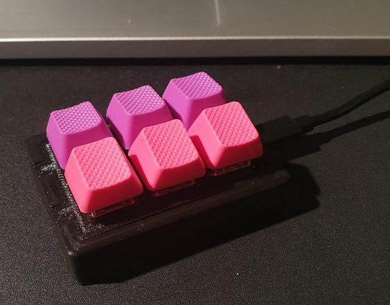

# Pico Macro keyboard (CircuitPython)
An easily reconfigurable macro keyboard that can press button combinations, like <kbd>ALT</kbd>+<kbd>Tab</kbd>. Suitable for using for shortcuts in a program, or for activating Auto-hotkey scripts.

Built with the Raspberry Pi Pico and CircuitPython.



# Hardware
* A Raspberry Pi Pico
* Some keyboard switches (I used *Durock T1 67g Tactile*).
* Key caps for the switches (I used *Tai-hao rubber keycaps*).
* An enclosure (if you have access to a 3D printer - this design worked for me: [`novaspirit#4812223@thingiverse.com`](https://www.thingiverse.com/thing:4812223), when I printed the lid with a skirt for adhesion, which suppressed deformations)

## Assembly
See the [fritzing schematics](./doc/fritzing) on how to assemble the keyboard (very simple).

# Software
The microcontroller was programmed with CircuitPython 7.0.0-rc.1.

## Installation

### Flashing CircuitPython 7+ on the Pico
* Download it from here: https://circuitpython.org/board/raspberry_pi_pico/
* Hold the BOOTSEL button while plugging in the Pico.
* Drop the CircuitPython.uf2 file in the Pico's CIRCUITPYTHON drive.

### Uploading the user code to the Pico
* Initialize the code in this repository (clone submodules etc.):
  ```console
  $ ./install.sh
  Cloning external submodules/libs
  Copying external libs into pico libs folder
  ```
* Copy all files from the [pico](./pico) folder to your CircuitPython drive.
* Unplug the Pico from the USB port, and plug it in again. Voilà!

# Usage
* Add mappings to config.json for the pins to key combinations. The file shall contain an array. Each element is an array of strings. Each string is the name of a key to press. The entry shall be null to leave the key unconfigured. E.g.
  ```json
  [
    ["A"], // Key 1 presses a (note that it is just the key, not the upper case character)
    null, // Key 2 does not press any key combination
    ["ALT", "Tab"], // Key 3 pressed ALT+Tab
    // The rest of the keys are not configured
  ]
  ```
* Hold down GP0 upon boot to enable only-keyboard mode
* If any key is held down during boot, then the program will exit (as a kill-switch in case there is a short)
